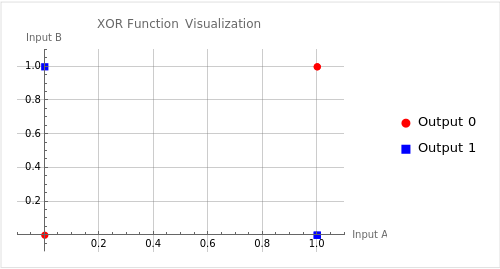

# Atividade ponderada 6 Inteli Módulo 8

Esse repositório contém os códigos para a seguinte atividade:

> Atividade em sala de aula para implementar um perceptron capaz de ser treinado para reproduzir o comportamento das seguintes portas lógicas:
>
> - AND
> - OR
> - NAND
> - XOR

# Como rodar

> [!IMPORTANT]
> Para rodar o código é necessário ter o Python 3 instalado na máquina.

Para rodar o código, primeiro é necessário baixar as bibliotecas necessárias. Para isso, basta rodar o seguinte comando no terminal:

```bash
pip install -r requirements.txt
```

Após isso, basta rodar o seguinte comando no terminal:

```bash
python3 perceptron.py
```

A partir de então, você verá em seu terminal o resultado de cada perceptron para cada porta lógica.

# Implementação do Perceptron em Python

O perceptron é um dos blocos de construção fundamentais da aprendizagem de máquina, especialmente no campo das redes neurais. Aqui vou detalhar a implementação de um perceptron de camada única em Python, sua aplicação para resolver operações lógicas básicas e explicar por que algumas operações não podem ser resolvidas com esta abordagem.

## Estrutura do Perceptron

A classe `Perceptron` é definida com os seguintes atributos e métodos:

- **Atributos Iniciais**: Taxa de aprendizado (`learning_rate`), número de iterações (`n_iterations`), limiar (`threshold`), pesos (`weights`) e viés (`bias`).

- **Função de Ativação**: Uma função degrau que retorna 1 se a entrada é maior ou igual ao limiar, caso contrário 0.

- **Previsão**: Calcula a soma ponderada das entradas, adicionando o viés e aplicando a função de ativação.

- **Treinamento**: Ajusta os pesos e o viés com base no erro entre a saída prevista e a saída real, em cada iteração sobre os dados de treinamento.

## Aplicação em Operações Lógicas

O perceptron foi treinado e testado nas operações lógicas AND, OR e NAND. Os resultados foram como esperados para todas as operações, exceto quando aplicado à operação XOR. Nesse caso, o perceptron não conseguiu aprender corretamente a relação.

## Limitação na Operação XOR

O XOR (exclusive OR) é uma operação lógica que não pode ser resolvida com um perceptron de camada única. Isso ocorre devido à sua natureza não linear. O XOR é linearmente inseparável, o que significa que não podemos desenhar uma única linha reta para separar as entradas de saídas 0 e 1.

<!--  -->
<p align="center">
  
</p>

### Explicação Detalhada

- **Linearidade**: O perceptron é um modelo linear. Isso implica que ele só pode aprender relações que são linearmente separáveis. Em outras palavras, se as saídas podem ser separadas por uma linha reta no espaço de entrada, o perceptron pode aprender a relação.

- **Operações AND, OR e NAND**: Estas operações são linearmente separáveis. Por exemplo, no caso do AND, todas as entradas que levam à saída '1' podem ser separadas daquelas que levam à saída '0' por uma linha reta.

- **Operação XOR**: No caso do XOR, não há como traçar uma única linha reta que separe as entradas de saídas 0 e 1. Isso requer uma abordagem que possa modelar a não linearidade, como uma rede neural com múltiplas camadas.

## Conclusão

O perceptron de camada única é eficaz para operações lógicas simples, mas sua aplicabilidade é limitada a problemas linearmente separáveis. Operações como XOR, que exigem a modelagem de não linearidades, requerem estruturas mais complexas, como redes neurais multicamadas.
